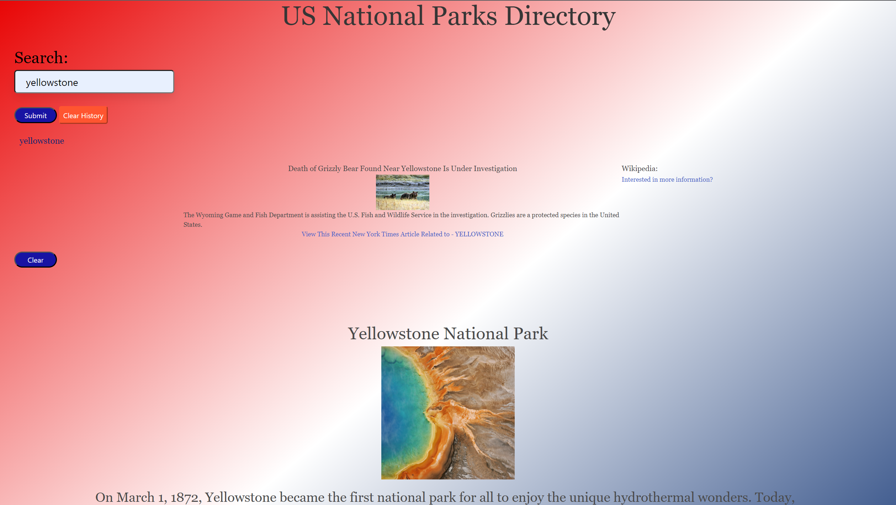

# US National Park Directory

## Description

The challenge for this assignment was to build a US National Park Directory that will run in the browser and feature dynamically updated HTML and CSS that is powered by JavaScript.

In this project, we learned how to implement:
- Agile software development: to manage a project with members from geographically dispersed areas.
- Server-side APIs: Accessed data from US National Park Service, NYTimes, and Wikipedia.

## Installation

N/A

## Usage

Click [Here](https://zamorejake.github.io/US-ParkLocator/) to go to our deployed webpage. Insert a US Park in the search field, then click submit. The webpage will then display information on the US Park, a recent NYTimes article related to your search, and the associated WikiPedia page for the query. Your search inputs are also saved to the screen so that you can view your past searches. You can clear your search history  with the 'Clear History' button, and you can clear the content generated by the query with the 'Clear' button.

Once the webpage is open, view local storage data as you interact with the webpage by right-clicking and selecting inspect; or for windows - Control + Shift + I and for MacOS - Command + Option + I. To see local storage, navigate to the the application tab and local storage to observe save values. 

---
Here is a look at the deployed webpage:

## Credits

N/A

## License

Please refer to the LICENSE in the repo.